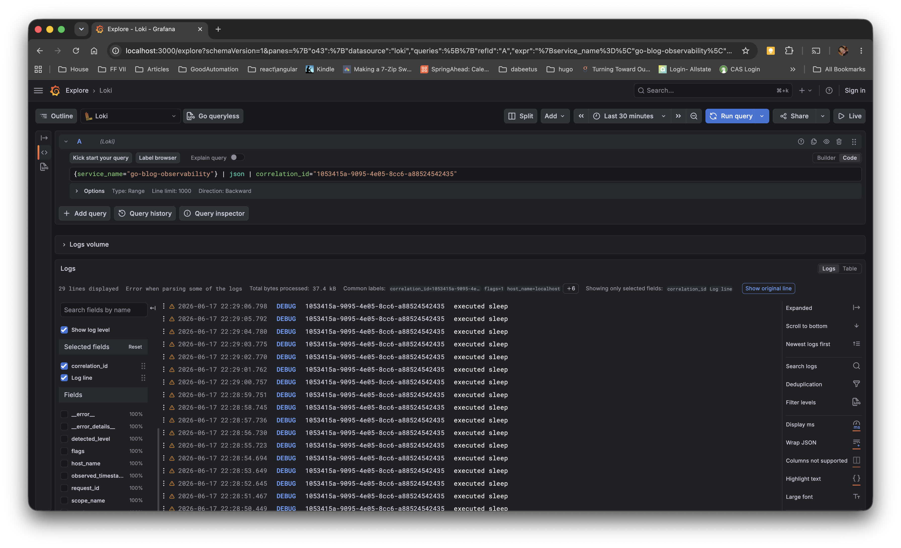

# go-blog-observability (github.com/antonio-alexander/go-blog-observability)

The purpose of this repository is to dive into tooling for observability in the Go programming language with a focus on Open Telemetry. We'll cover logs, metrics and traces along with a proof of concept built from the [go-blog-cache](https://github.com/antonio-alexander/go-blog-cache) and [go-example-rego](https://github.com/antonio-alexander/go-example-rego) repositories.

Upon completion of this repository, you should have an opinion on:

- how to create structured logs
- what metrics can help you identify endpoint latency or heavy endpoint usage
- how traces can be used to contextualize where latency is occurring
- how you can use correlation, request and trace ids to relate logs and traces
- how you can use a custom grafana image to visualize these traces, logs and metrics

## Bibliography

- [https://medium.com/@renaldid/i-rebuilt-observability-in-our-go-services-heres-what-happened-to-logs-traces-and-metrics-4114c59844e9](https://medium.com/@renaldid/i-rebuilt-observability-in-our-go-services-heres-what-happened-to-logs-traces-and-metrics-4114c59844e9)
- [https://opentelemetry.io/docs/concepts/observability-primer/](https://opentelemetry.io/docs/concepts/observability-primer/)
- [https://go.dev/blog/slog](https://go.dev/blog/slog)
-[https://www.lucavall.in/blog/opentelemetry-a-guide-to-observability-with-go](https://www.lucavall.in/blog/opentelemetry-a-guide-to-observability-with-go)
- [https://grafana.com/blog/an-opentelemetry-backend-in-a-docker-image-introducing-grafana-otel-lgtm/](https://grafana.com/blog/an-opentelemetry-backend-in-a-docker-image-introducing-grafana-otel-lgtm/)

## TLDR; Too Long Didn't Read

Observability is a tool that allows you to see what your application is doing in real time that _isn't_ running your application in debug mode. Tools such as logging, traces and metrics allow you to contextualize how your application is running and move beyond knowing that it's working or not working, but how well it's working and in what situations does it work well.

Logs help tell you when something occurs and is the basis for all observability, unlike traces and metrics, logs can contain significantly more information about what's happening at a given moment. These logs can have different severity levels such as info, error, debug, warn etc. Additionally logs will contain a timestamp and depending on how you use them additional information to help relate it to traces and metrics like:

- correlation id: a high-level id used to relate multiple requests
- request id: a high-level id used to relate a single request for a given application/endpoint
- trace id: an id for a slice of functionality for a given layer (e.g., database call)
- hostname: the hostname (or pod name) for a given instance of an application

Traces help you understand not only how a request flows through a system, but how much time it spends at each layer and related processes. A request may take 10s, but without understanding where it spends its time, you're left guessing where that time is spent: is it the database, is it processing in the controller or is the majority of the time spent in transit (the request bytes getting to the consumer)? Traces help you not only identify where time is being spent, but visualize that as well.

Metrics help you understand how much of something is occurring at any given time. One of the more common metrics is a counter, a counter can increment forever or increment and decrement. Counters give you an overall view of how much of something is occurring: how many requests are currently in flight (up and down) how many requests have been processed for a specific endpoint over a period of time. Metrics, when coupled with things like logs and traces can help you identify when a problem is occurring.

Observability...or rather the signals it creates can help you identify __when__ a problem is happening.

## Getting Started

<!-- REVIEW: should we include a TLDR here? -->

## Maxims

These are some maxims or simple ideas that I came up with while working on this:

- Logs shouldn't communicate something you can find directly; for example if I want to know the version of something running, I shouldn't look to the logs to figure that out, but should be looking at the helm charts or hitting an endpoint that would give me the version. Although it may look nice or be useful, it simply gives you a log that has very little value
- You shouldn't have _trace_ logs...you should have __traces__ that you can connect to those debug messages
- You should log errors across boundaries (e.g., service <-> client <-> facade <-> consumer)

## Observability

While the general topic of observability is grand, I think the easiest way to think about it is from the perspective of someone who can do it without the instrumentation. There exists a few senior developers who have enough experience to see an error or behavior, make inferences and make a judgement call often resulting in fix or mitigation of the issue at hand. At a glance, this is indistinguishable from magic and at one time could be considered _job security_.

> Although the example is tangible, let’s assume that the application in question is __sane__, deterministic and well written; fixing an issue in a non-deterministic application isn't actually a fix but a guess

While the sentiment of hoarding knowledge hasn't gone away, observability solves the problem of making things that are human readable, machine readable and enabling the ability to codify identification of issues that are appropriately observable.

A sane, deterministic and well written application works like a control system: it responds to and respects __physics__. If someone says the system is slow, there should be increased latency _somewhere_ related to that experience; similarly in a control system a temperature controller has __physical__ limits to how fast it can heat a space from a given temperature. When it comes to scale; these are your waypoints...given that your application is sane and deterministic.

Observability, like [benchmarking](https://github.com/antonio-alexander/go-blog-benchmarking), should start from something concrete: what's a specific situation that you want to be able to deterministically identify? Below are a few examples and while not exhaustive, they should help contextualize what problems observability tooling can help to solve:

- At certain times of day, users report that the system is slow, but when you observe the behavior of the system otherwise it's performance is nominal, how could I determine if the user is telling the truth?

> You could pull traces for other user operations on similar endpoints during that time of day and determine if the total request time is less than nominal/average over different time periods for different users. It's always possible that it's specifically the user (maybe they lack access that requires the system to take longer to pull data) or it's a systemic issue, but that kind of information allows you to say that it's a systemic or a user issue with certainty

- Whenever we add a new item to the database where the application has a cache, there's a resource spike in the database even though the item is cached, why is this happening?

> If you had metrics for cache hits and cache misses, you could look at the ratios of cache hits/misses (if possible for that specific object) around this time period; you may find that you have a cache stampede and that for a period of time, the data's not in the cache (even though you're caching it)

- When a user presses a button it kicks off a process that occurs in two separate systems but generally fails, it's not clear which system is failing and why

> If you generate a correlation id at the start of that process where the user presses the button and pass this through the request, you should be able to pull ALL of the logs and traces from that starting request and determine which trace/request took the longest

- There's an error that shows up in the log periodically, but there's so much data in general, we can't pinpoint that specific phenomena out of the mass of data that we have

> This is solved with error logs and appropriate GRANULARITY; if you can specify what kind of error it is, it's much easier to say show me errors of this specific _type_ and then give me the correlation ids associated with those errors to find the other associated logs and traces to help troubleshoot the issue; with this kind of setup you may even be able to filter ALL traces/logs with this kind of thing so if you only want to keep say 90% of all logs/traces, you can exclude these

The key to observability is identification (or signaling) and increasing the granularity such that you can create a narrow dataset and identify if an issue (or rather scenario) is happening. Observability can be achieved through three different tools: logs, metrics and traces.

Logs communicate something that happened, whether it be an error, a debug message or simply an information message that this "thing" has happened. Logs should be used to communicate when something happens that's worthy of note whether that something is pretty verbose or run of the mill.

Metrics communicate how much of something has occurred over a period, this generally involves counters that say how many times something has occurred (e.g., request failures) or how many somethings are currently in progress (e.g., in flight requests). Metrics can be _actual_ counters or could be a counter on the number of specific kinds of error logs.

Traces can communicate the flow of a given request across one or more systems; it can tell you how much time a given request spent doing a specific thing; when troubleshooting latency issues or failures, traces can help you identify where your latency or failures occurred and under what circumstances sometimes.

The most important piece of logs, metrics and traces are the attributes you assign to them, attributes help you codify the relationship that identifies a specific scenario: "If this kind of error occurs more than one time within a minute, a given scenario is occurring." An attribute can be something like the endpoint being accessed or the kind of error that occurred (e.g. 404), it could also be the specific data object that's being accessed.

## Identification, Correlation and Cardinality

These three things: identification, correlation and cardinality will make or break the efficacy of your observability solution. If you lack the ability to identify a given instance of a scenario (e.g., a complete request), you won't be able to exactly identify a given scenario and by extension your ability to automate notification or mitigation will also fail. For example, let’s say that you could only correctly identify the scenario 50% of the time, but the mitigation was the restart the service, that means that 50% of the time, you may restart the service unnecessarily and that may have knock-on effects...that you may create instrumentation for to mitigate so forth and so on (an ouroboros if you will).

There are three ids that I think make the most sense (so far):

- correlation id: this is a unique id from the starting point of a given operation which may involve one or more request ids
- request id: this is the unique id from when a request is received by a server
- trace id: this is the unique id from a given part of that request; it may cover ONLY the database operation

These ids are the basic things that limit the amount of data you have to pour through; a proper correlation id can pick out everything that happens with a given operation: from the user's perspective they may just be pressing the 'do it' button, but it may kick off various processes that may be both synchronous and asynchronous.

> For example, I put together a notification's application which allows _scheduling__ of a notification, an inherently asynchronous process. When the request is made, I store the correlation id of that request, so when the notification is eventually triggered, logs for failures can connect the two together rather than orphaned observability from an  asynchronous process

These ids when used together allow you to focus on specific portions of a given request to figure why something was successful or failed. This _correlation_ gives you the ability to do find _useful_ information. Along with these specific ids, you may also add attributes which further enrich your logs, metrics and traces.

One of the things you find out after, especially in applications that dynamically scale, is that you may run into issues that affect only specific pods or pods that have specific images (maybe you pushed a different image to the same tag). The absence of the source pod name (or in some cases the host name) can blind you to being able to correlate that transient issues that may re-appear on the same pod or host (or the configuration therein).

Cardinality affects your ability to identify and find information you're interested in. In general, things that don't change often have low cardinality, but things that change often have high cardinality (assuming that the keys remain the same). Things like host name, correlation id, severity and error types have low cardinality while things like the error message or the user id may have very high cardinality and be relatively useless on its own, but when paired with low cardinality things, or related counters it can help you relate the things that matter.

## Context

I did a session on context in Go [https://github.com/antonio-alexander/go-blog-context](https://github.com/antonio-alexander/go-blog-context) covering it's utility. It's heavily used in observability to maintain the opaqueness of certain attributes while keeping the api clean, instead of having to pass around a struct with a lot of objects, you can just pass around the context. Below is a copy+paste from that article to briefly describe contexts and what they can do:

> Contexts are a flow control mechanism in Go that can be used to communicate to one or more listening processes that they should stop. Context can be configured to signal "stop" on execution of a cancel function or after a certain time passes. Different contexts can be linked together such that if the parent context stops, all child contexts will also stop

The observability solutions heavily utilize a side-effect of contexts: that they can be used to store session/request level information such as the user making the request or the correlation id; things that would be useful to communicate through the stack and be ignored by certain processes that may only care about the flow control aspect of the context.

As I said in that repository, contexts are all or none, it's either everywhere or no-where, so architecturally, this is also something you'll have to deal with.

> The observability library contains a number of global functions where if you don't provide a provider, it'll use a global tracer, metric or logger; although this is useful it's not the use case this repository is based upon (i.e., what if you imported a library that isn't well written and modifies those global values in the same application space?).

## Logging

Logging generally involve statements that are printed to standard out to describe what's happening at any given time. Those logs should have at least three parameters:

- timestamp: when this thing happened
- log level: this can be almost anything, but common levels are ERROR, INFO, DEBUG and WARN (these are not in order)
- message: the _thing_ that's happening

Here are a few examples of logs:

1. `[<service>:INFO:2026-06-05T19:07:04Z] something happened`
2. `[INFO](2026-06-05T19:07:04Z): something happened`
3. `{"level":"INFO","timestamp":"2026-06-05T19:07:04Z","msg":"something happened"}`

None of them are terrible, but the first two are difficult to parse without regular expressions and even though those regular expressions can be deterministic, there may be changes that occur that cause them to capture more (or less) than expected and there may not be an established schema. For example, if someone had a level with a colon in it (for whatever reason), it may be hard to parse the level out.

The third log is ideal because it's schema is understood (JSON) and with the way json rules are setup, there's already support for nested structures and how to handle strings; especially strings with special characters (i.e., escaping); these are ideal for parsing as long as the keys are consistent and easily scales when you add new attributes.

For observability, _structured_ logging is ideal because it’s much easier to parse allowing you to have consistent and deterministic alerts and __identification__.

> One of the most helpful perspectives I read on logging is that logs should be machine readable __first__ and human readable second

Speaking only for myself, most of my logs use `fmt.Sprintf` where I include a number of different parameters to describe what happened; these are human readable and although they may be deterministic and consistent; the rules are also very specific and don't give you much ability to logically relate them.

For example, let’s say that a user isn't authorized to do something; we could print a log that says:

```go
logger.Error(ctx, "user (%s) is not authorized to perform action (%s) on object (%s)", userId, action, objectId)
```

```sh
[ERROR](2026-06-05T19:07:04Z): user (5449c7b7-d165-4c6d-bced-c0b61604f454) is not authorized to perform action (read) on object (b03f593e-3c01-4808-89f3-c7e92f34297a)
```

And although this is very human readable, it doesn't help you when it comes to observability; a better solution uses structured logging to give the same information, but in a way that's easier to parse:

```go
logger.Error(ctx, "user not authorized", 
    slog.String("user_id", "5449c7b7-d165-4c6d-bced-c0b61604f454"),
    slog.String("action", "read"),
    slog.String("object_id", "b03f593e-3c01-4808-89f3-c7e92f34297a")
)
```

```sh
`{"level":"ERROR","timestamp":"2026-06-05T19:07:04Z","msg":"user not authorized","user_id", "5449c7b7-d165-4c6d-bced-c0b61604f454", "action", "read","object_id", "b03f593e-3c01-4808-89f3-c7e92f34297a", "object_type": "object"}`
```

While a much bigger pain to read, it allows you to more easily answer questions like:

- what specific users weren't authorized to read an object from time a to time b?
- is there an increased rate of unauthorized errors when attempting to read a specific kind of object?

These questions now become __much__ easier to ask and answer with structured logging versus the previous and makes it easier to know what's missing (i.e., what information am I missing to properly ask this question?).

> But obviously it's not that easy right...logs are everywhere and you can't just switch over right? and I still have errors to standardize and...etc. So the next few sessions attempt to talk more about that and make some suggestions

You can use Grafana (Loki) to visualize logs; you can run the [service](./cmd/service/main.go) and via `make swagger` in the [Makefile](./Makefile) or through [scenario](./cmd/scenario/main.go) generate logs that you can explore in [Grafana](http://localhost:3000). You can filter logs by service and correlation id with a query like: `{service_name="go-blog-observability"} | json | correlation_id="1053415a-9095-4e05-8cc6-a88524542435"`. It would yield something that looks like:



### Errors

Errors communicate when something is wrong; errors may happen often or sporadically. So sure, you have structured logs, and you implement traces and metrics, but if your errors still suck and aren't properly integrated, you've put a very small band aid on a flesh wound. __Your error logs will only be as good as your errors.__

Go is very hammer and screwdriver when it comes to errors; for those of you who don't know an error is any object that implements the method `Error() string`. So almost anything can be an error and although printing the error is helpful/conventional, it creates the same problem our structured logs attempt to resolve. For example, sticking with the not authorized error described above, it could look like:

```go
err := fmt.Errorf("user (%s) is not authorized to perform action (%s) on object (%s)", userId, action, objectId)
logger.Error(ctx, "error while reading object", slog.String("error", err.Error()))
```

With structured logging, this would give you something like:

```go
`{"level":"ERROR","timestamp":"2026-06-05T19:07:04Z","msg":"error while reading object", "error":"user (5449c7b7-d165-4c6d-bced-c0b61604f454) is not authorized to perform action (read) on object (b03f593e-3c01-4808-89f3-c7e92f34297a)"}`
```

So even though this is convention, it re-creates the same problem we fixed with structured logging. So the solution is similar, we make errors more useful and separate the data. I reiterate that GO is a very _hammer and nails_ language such that it asks you to fix your own problem.

We can solve this problem by creating a more useful error structure:

```go
const errUnauthorized string = "not authorized"

func ErrUnauthorized(userId, action, dataType string, dataId *string) error {
    return errors.ErrorUnauthorized{
        ErrorCommon: errors.ErrorCommon{
            ErrorMessage: errUnauthorized,
            ErrorType:    errors.ErrorTypeUnauthorized,
            DataId:       dataId,
            DataType:     &dataType,
            Local:        true,
        },
        UserId: userId,
        Action: action,
    }
}

func _ {
    err := ErrUnauthorized(claims.UserId, "create", "employee", nil)
    logger.Error(ctx, "error executing request", err.GetAttributes()...)
}
```

This would yield a log like the following:

```sh
`{"level":"ERROR","timestamp":"2026-06-05T19:07:04Z","msg":"error executing request", "error":{
"error_message": "not authorized","error_type":"ERR_UNAUTHORIZED","data_id":"b03f593e-3c01-4808-89f3-c7e92f34297a", "data_type":"employee", "local": true, "user_id":"5449c7b7-d165-4c6d-bced-c0b61604f454", "action":"create"}}`
```

This new error log provides just as much information in the right format and schema as the earlier logs while maintaining some of the syntax as we had earlier. I intentionally skipped over a lot of magic that actually happens, if you're interested, please see the implementation in [./internal/pkg/errors](./internal/pkg/errors) and [./internal/authz/](./internal/authz/)

Related to this, you should also have an easy way to map errors to http status codes. While not necessary, once codified, it simplifies your implementation as to what status code you should give and when as well as when you need to support different status codes. Below is what's implemented within this repository:

```go
package errors

import "net/http"

type ErrorType string

const (
    ErrorTypeNotFound       ErrorType = "ERR_NOT_FOUND"
    ErrorTypeNotCreated     ErrorType = "ERR_NOT_CREATED"
    ErrorTypeNotUpdated     ErrorType = "ERR_NOT_UPDATED"
    ErrorTypeConflict       ErrorType = "ERR_CONFLICT"
    ErrorTypeNotCached      ErrorType = "ERR_NOT_CACHED"
    ErrorTypeNotCachedRetry ErrorType = "ERR_NOT_CACHED_RETRY"
    ErrorTypeValidation     ErrorType = "ERR_VALIDATION"
    ErrorTypeTimeout        ErrorType = "ERR_TIMEOUT"
    ErrorTypeUnknown        ErrorType = "ERR_UNKNOWN"
    ErrorTypeNotImplemented ErrorType = "ERR_NOT_IMPLEMENTED"
    ErrorTypeUnauthorized   ErrorType = "ERR_NOT_AUTHORIZED"
    ErrorTypeExciting       ErrorType = "ERR_EXCITING"
)

func (e ErrorType) String() string {
    return string(e)
}

func (e ErrorType) StatusCode() int {
    switch e {
    default:
        return http.StatusInternalServerError
    case ErrorTypeNotFound, ErrorTypeNotCached:
        return http.StatusNotFound
    case ErrorTypeNotCachedRetry:
        return http.StatusTooManyRequests
    case ErrorTypeConflict:
        return http.StatusConflict
    case ErrorTypeTimeout:
        return http.StatusRequestTimeout
    case ErrorTypeNotImplemented:
        return http.StatusNotImplemented
    case ErrorTypeUnauthorized:
        return http.StatusUnauthorized
    }
}
```

Because it's the Go convention to wrap errors, there may be "more" information within an error that's useful; this is something you should include with the idea that it may never be easy to search through; also it's generally just a concatenation of all errors with a colon. For more information on wrapping errors, you can read the following: [https://go.dev/blog/go1.13-errors](https://go.dev/blog/go1.13-errors)

Similar to logs, errors may have value both between and beyond package and application boundaries. Errors have value in three places:

- when an error traverses a package boundary (i.e., from internal/pkg/policy to /internal/authz)
- when an error meets an application boundary (i.e., when a request leaves the service via /internal/service)
- when an error is received by a client (i.e., from internal/service to internal/client) or beyond

As an error traverses boundaries, depending on its audience, you may want to re-create the error for mitigation (or resolution) of the problem. Although I think it's important enough to simply be able to re-create an error to log it where it matters. It may be more important/useful to simply be able to determine the log and log it at the appropriate boundary.

> An interesting...feature of the error implementation is that it has a field called 'local' which isn't exported, so once it leaves the application boundary, its always false; knowing whether an error occurred locally within the application or remotely, means a whole lot when your application has a significant number of layers

### Panics (or Exceptions)

Panics should never occur, but when they do, sometimes the result can get mangled in the logs bad enough that it's hard to figure out __why__ the panic occurred. Panics are often difficult to log because they involve a multi-line response. But (you guessed it); Go has plenty of ways to handle this and the solution is relatively simple:

- use a recover function at the top most location the panic would roll up to without killing the application
- log the results of that recover function in a format that helps

> When a panic occurs and isn't recovered, it __WILL__ stop the application or at least up to the calling go routine (async thread). If you're not aware, every endpoint runs in its own go routine, so if an endpoint panics, it could do so quietly if no one's listening

By virtue of the existing design and the defer functions, you should be able to determine the following when you log a panic:

- the trace where it happened (via timestamp, correlation id and request id)
- the line where the panic occurred (this may be something you want to obfuscate)
- the package where the panic occurred

> Although it may sound confusing, the trace id will most likely be unavailable unless you have a recover function at each level for each function, because the trace id is injected at each level, the middleware where you'd most likely have your recover function won't have a context with that trace id available

The middleware function would look like the following:

```go
func (s *service) middleware(route string, next http.HandlerFunc) http.HandlerFunc {
    return http.HandlerFunc(
        otelhttp.NewHandler(http.HandlerFunc(func(w http.ResponseWriter, r *http.Request) {
            spanName := fmt.Sprintf("%s %s", r.Method, route)
            correlationId, requestId := getCorrelationId(r), internal.GenerateId()
            ctx := pkgcontext.WithHostname(
                pkgcontext.WithCorrelationId(
                    pkgcontext.WithRequestId(
                        r.Context(), requestId), correlationId), s.config.hostname)
            ctx, span := s.Start(ctx, spanName)
            defer span.End()
            defer func(ctx context.Context) {
                if r := recover(); r != nil {
                    if counter, err := s.readCounter(counterPanicTotal); err == nil {
                        counter.Add(ctx, 1)
                    }
                    args := make([]slog.Attr, 0, 2)
                    args = append(args, slog.String("stack_trace", string(debug.Stack())))
                    args = append(args, slog.String("panic", fmt.Sprintf("%v", r)))
                    if runErr, ok := r.(runtime.Error); ok {
                        args = append(args, slog.String("runtime_error", runErr.Error()))
                    }
                    s.Warn(ctx, "panic has occurred", args)
                }
            }(ctx)
            r = r.WithContext(ctx)
            if counter, err := s.readCounter(counterActiveRequests); err == nil {
                counter.Add(ctx, 1)
                defer counter.Add(ctx, -1)
            }
            next(w, r)
            if counter, err := s.readCounter(spanName); err == nil {
                counter.Add(ctx, 1)
            }
            if counter, err := s.readCounter(counterRequestsTotal); err == nil {
                counter.Add(ctx, 1)
            }
        }), route).ServeHTTP)
}
```

This tells us the pertinent information for the panic, logs it at a high severity (WARN) and increments a counter that tells us total panics so we can determine if there's a general increase in panics along with what actually panicked.

> I'll note that panics aren't expected to happen and generally, resolving panics require code changes or data/schema changes

## Metrics

<!-- TODO: define counters, histograms, gauges, talk about how you have some counters that go up and down and some that only go up and what situations where they matter, ensure that you take some time to describe how to visualize them in grafana -->

Metrics help you quantify what's happening on your system, generally relative to itself; with metrics you can quantify things like latency, traffic (in its many forms) and how you're using your resources (e.g., cpu/memory). Below are some questions that metrics can help you answer:

- How much data is being received by your application?
- How much data is being sent by your application?
- What's the latency of a request for a given endpoint? What's the aggregate latency for all requests for a given endpoint? What's the latency for the slowest 1% of requests for a given endpoint?
- What's the error rate for a given endpoint? for the entire application?
- At any given time, how many requests are in flight?

Metrics help you quantify information about your application; when something _stops_ working, it's often a gradual thing which gets bad before it gets worse. For example, resource constrained operating systems generally don't defragment memory: whether a memory leak or constant memory allocation, if for some reason you can't allocate a contiguous chunk of memory the system will simply panic (like a kernel panic). There will be signs:

- it could take longer to acquire contiguous memory, so CPU increases (e.g. [priority inversion](https://en.wikipedia.org/wiki/Priority_inversion))
- latency could increase as it takes longer to acquire memory as defragmentation increases
- largest contiguous available memory could shrink
- maximum available memory could steadily decline without normalizing
- requests in flight increase even though there's not additional load on the application

All of the above are signals; some quiet, some loud that can help you quantify and contextualize a problem; not only that, but they can also be useful for diagnosing what happened post incident. Now that it's happened, we can look back at our metrics and determine if there were signals that weren't instrumented or were there no proper baselines for the alerts or was it completely invisible to our existing instrumentations (i.e., we need to add new metrics).

There are three kinds of metrics that we'll talk about: counters, guages and histograms. Counters can be used to count up (only) or up and down to record a quantity of _something_ while guages can be used to give you current value snapshot of _something_ while a histogram stores information in buckets that can be used to compare data...in more interesting ways (more on this later).

<!-- TODO: figure out how to capture latency and put together a p99 latency -->

## Traces (and Spans)

The observability you get with traces and spans is generally the following:

- duration, how long a given process took to complete
- hierarchical organization of work (e.g. you can see how long it took to run a database query versus logic before it)
- a way to filter logs (and metrics) by use of trace ids which by extension lets you know _where_ an error happened (not just what it is)

The observability you get through traces and spans, although verbose, helps you identify _where_ an event occurred and can help contextualize latency. It's one thing to understand that you have some requests that take a long time, but without traces, it's difficult to identify if that time is spent waiting on a database connection to become avaialble or because the query itself lacks proper indexes to be performant.

<!-- mention why span names must have low cardinality -->

<!-- TODO: mention how to visualize in grafana -->

## Scenarios

There are a number of scenarios that can be used to generate specific kinds of signals that can be observed through grafana using tempo, prometheus and loki. The scenario application will print correlation ids you can use to filter those signals.

### Percentile Latency (percentile_latency)

### Sustained Traffic (sustained_traffic)

### Stampeding Herd (stampeding_herd)

### Cache Not Found (cache_not_found)

### Sleep Retry (sleep_retry)

<!-- TODO: add section describing certain scenarios and how we can use logs, metrics, traces (and spans) to identify them -->

## Issues I Ran Into

- The Go [example](https://github.com/grafana/docker-otel-lgtm/tree/main/examples/go) didn't work out of the box, I got http client with https server errors

> See: [https://github.com/open-telemetry/opentelemetry-go/issues/4834](https://github.com/open-telemetry/opentelemetry-go/issues/4834); was able to fix the problem with setting the environmental variable OTEL_EXPORTER_OTLP_ENDPOINT to `https://localhost:4318`

- Converting existing logs to structured logs felt incorrect at first

> There's a general shift from human readable first to machine readable first; the attributes feel kind of clunky, but once you get used to them it makes a lot of sense. What helped me was to NOT use fmt.Sprintf and that made me think about how to organize the errors; additionally, communicating information via errors rather than doing it from everywhere simplified some of the figuring out which attributes to communicate

- Much easier to instrument packages than actual implementations

> One of the things I found over and over again was that implementing traces and metrics at the implementation/business logic levels was a slog (not structured logging). It took a lot of code and made the code surrounding it much harder to read. In a lot of cases (e.g. redis, database/sql and even http) I found that instrumenting the base package was very easy and hidden away so it would give you the extra functionality without hurting readability. So...if you've abstracted your basic functionality into its own package (as you should be); it’s much easier to instrument that package than the code that uses it

- Really wanted to crutch on seeing logs, metrics and traces via standard out and that was easier said than done

> I added some configuration that would enable standard out for traces and metrics, but in an opt-in way (off by default). Although useful, they spew a lot of information that makes it a pain to read at a glance, so although the logs are still going to open telemetry, they won't go to standard out; I’ll also note that in my opinion, even though you _could_ look at and parse the counters from standard out, it's a terrible experience

- Had issues ensuring that ids were propagated through all the logs without it being complex

> While this is a relatively easy problem to solve, at first it may not seem so easy. I solved this by injecting all of the ids into the context in the service and ensuring that for situations where I created new objects, I added those ids as attributes

- I had issues with the resource being chatty with the default resource

> I fixed this by creating my own resource with a simple set of attributes (hostname and service name)

## Frequently Asked Questions

- What if I want to have traces...but not print those __trace__ logs?

> This is _easier_ with the open telemetry setup since you can have multiple exporters; you'd have to create a standard out exporter and have it only print logs for a specific level, while the trace logs could still be exported via an open telemetry handler

- What if I want to put an entire json body in an attribute?

> Well...you shouldn't, but if you do, you should do it similar to errors (see GetAttributes() in [./internal/pkg/errors/error_common.go](./internal/pkg/errors/error_common.go)) where there's a nested attribute added. Nested attributes are a little clunky, but support the use case without having to do additional parsing, structured logs are already json, so maintain the theme

- I used fmt.Sprintf everywhere in our implementation to generate logs, how can I migrate over with less pain?

> This is a relatively easy solve; you can maintain the function prototype of fmt.Sprintf where it uses a string and then a variadic of any (or empty interfaces which is anything); from there in your code you can implement fmt.Sprintf like you would normally to create the string (so you don't lose existing functionality) and then process each of the args provided into an attribute. At first nothing will be attributes since it's all values with no keys, but you can slowly migrate while maintaining the existing pass throughs of correlation, request and trace ids

- Can't we just print counters at a set pace to standard out rather than using open telemetry metrics?

> Yes, this does work and is a common solution. I personally don't like it since it's not something that's easily consumable visually by humans. Using grafana or datadog is much better/easier to consume as a human

- Why do I need to use histograms to measure latency?

- What's your opinion on middleware when setting up your traces and metrics?
